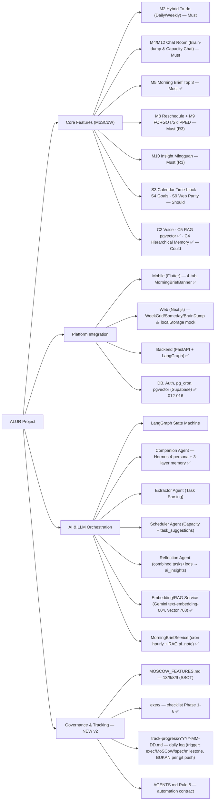
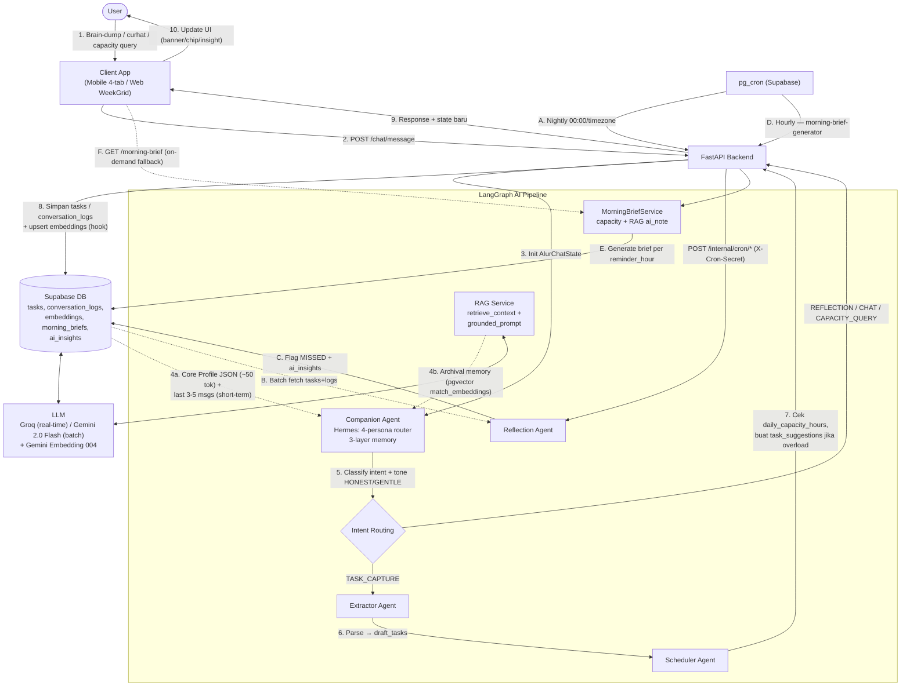
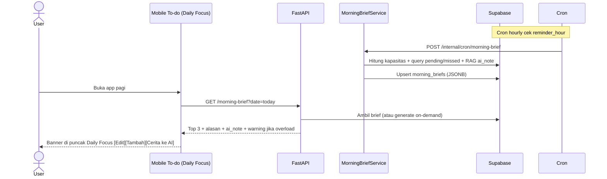
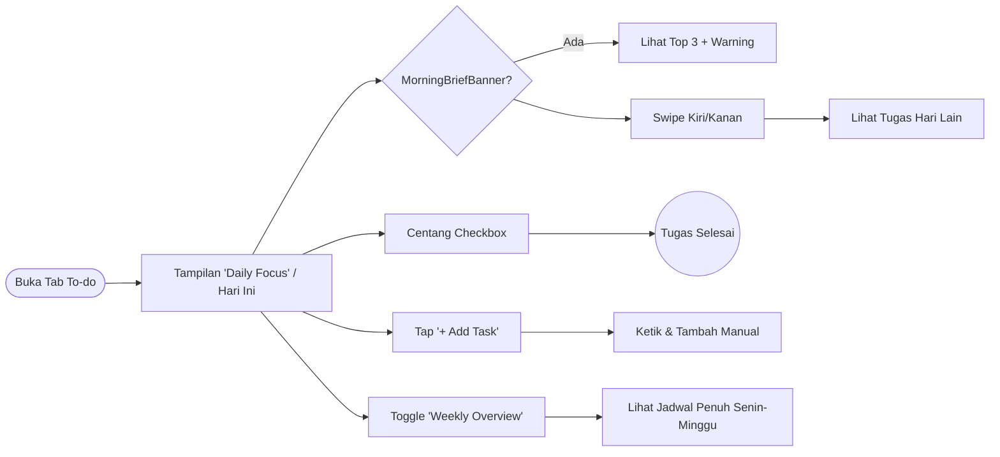
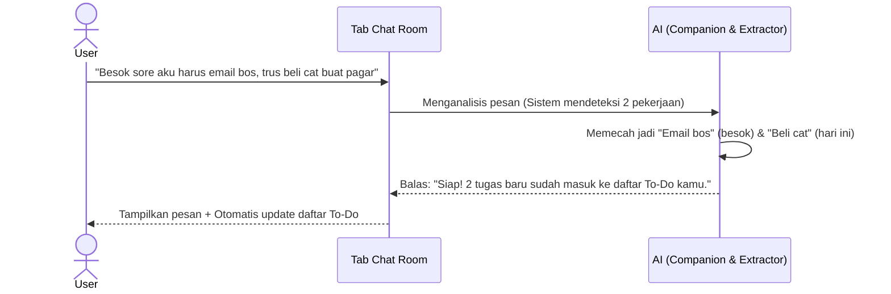
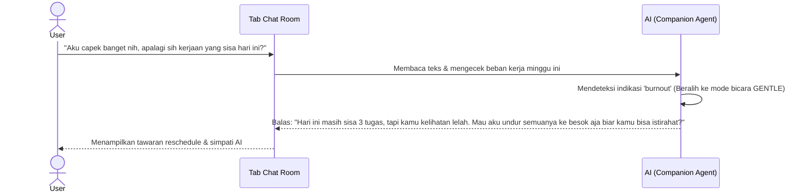
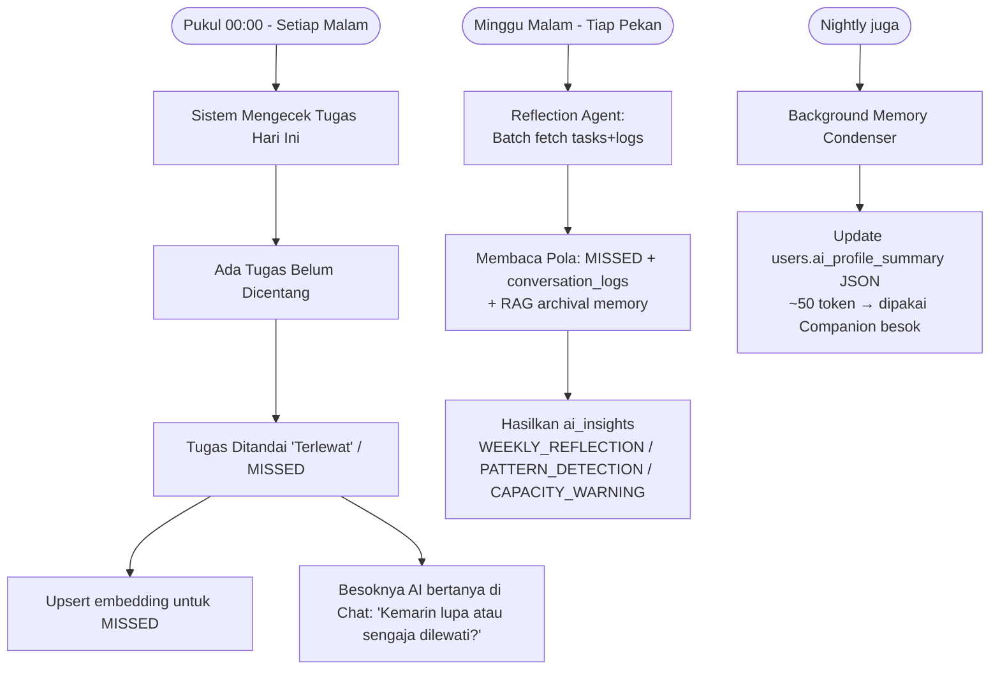
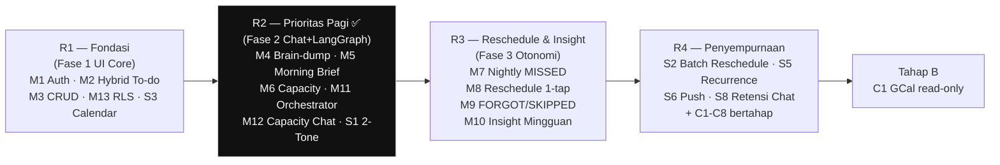
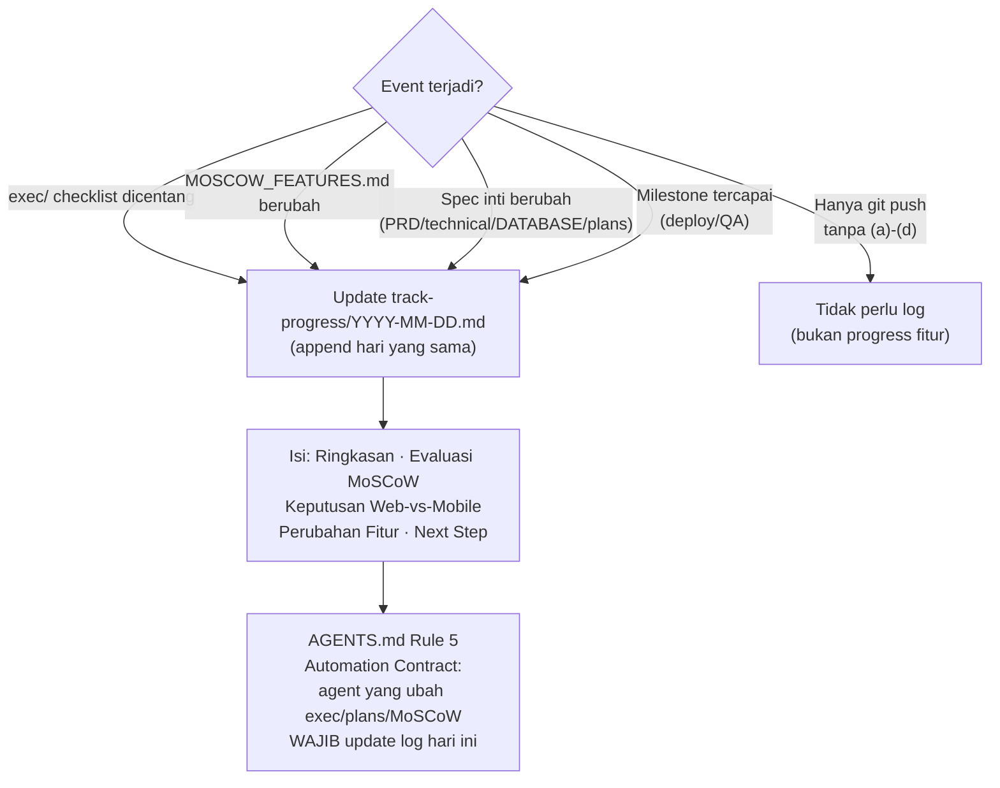

# Peta Konsep dan Alur Sistem ALUR

> **Versi:** 2026-09-30 v2 — Update: integrasi MoSCoW (13/9/8/9), Morning Brief & RAG selesai, `track-progress/` live
> **Sumber:** `PRD.md` · `technical.md` · `DATABASE.md` · `DESIGN.md` · `MOSCOW_FEATURES.md` · `exec/2026-09-28_exec-morning-brief-rag.md`

Dokumen ini memuat rangkuman visual ALUR: **apa yang dibangun, bentuknya seperti apa, bagaimana data mengalir**, dan **bagaimana progres dilacak**.

---

## 0. Ringkasan: Apa yang Kita Bangun?

**ALUR** = *productivity companion yang jujur tentang kapasitas kamu* — bukan to-do list yang bilang "kamu pasti bisa".

| Pertanyaan | Jawaban |
| :--- | :--- |
| **Masalah P1** | Bingung prioritas tiap pagi → **Morning Brief Top 3** + **Capacity Warning** |
| **Masalah P2** | To-do jarang tuntas → **Nightly MISSED** + **Saran Reschedule 1-tap** (dengan persetujuan, bukan auto-pindah) |
| **Masalah P3** | Tidak paham pola sendiri → **Insight Mingguan naratif** (combined `tasks` + `conversation_logs`) |
| **Bentuk Mobile** | Flutter — 4 tab: **To-do** (Daily Focus/Weekly) · **Chat Room** (brain-dump & curhat) · **Calendar** (time-block read-only) · **Profile** (goals & retensi) |
| **Bentuk Web** | Next.js — **WeekGrid 7 kolom + Someday Drawer + BrainDumpModal + TaskEditModal**, scope v1: To-do + Calendar saja (`PRD §3.6`) |
| **Bentuk Backend** | FastAPI + LangGraph (5 agent) + Supabase (Postgres + RLS + `pg_cron` + pgvector) |
| **Prinsip** | *Invisible Complexity* — UI sesederhana kertas, kecerdasan di backend. *FORGOT vs SKIPPED* — bedakan lupa vs sengaja. |

**Status 2026-09-30:** R2 (Prioritas Pagi) selesai — Mobile + Backend live, Web masih `localStorage` mock. Rekomendasi rilis: **Mobile dulu**, Web parity setelah API stabil.

---

## 1. Mindmap: Struktur Fitur, Integrasi, LLM & Progres

---

## 2. Flowchart: Pipeline Data & Proses Sistem (Updated v2)

Menambahkan **RAG retrieval**, **Hierarchical Memory**, dan **Morning Brief cron** yang selesai di R2.

**Catatan v2:** Garis `Rag` dan `Brief` adalah **baru** — keduanya sudah live (`embedding_service.py`, `rag_service.py`, `morning_brief_service.py`, migrasi `012–016`).

---

## 3. Alur Penggunaan Fitur (User Journey) — Tetap, + Morning Brief

### A. Morning Brief (NEW — Jawaban P1)

### B. To-Do (Eksekusi Harian & Mingguan)

### C. Brain-dump (Ekstraksi Tugas Otomatis)

### D. Curhat & Cek Kapasitas Beban Kerja

### E. Evaluasi Otomatis (Review Malam & Mingguan) + RAG Memory

---

## 4. Roadmap & Kerangka Kerja (Selaras MOSCOW_FEATURES.md)

Rekomendasi rilis (`track-progress/2026-09-30.md`): **Mobile R2 dulu** → Web parity (S9) setelah API stabil → R3 bersamaan untuk kedua platform.

---

## 5. Kerangka Tracking Progres (NEW v2)

> **Bukan per `git push`.** Commit ≠ progress fitur. Log ditrigger saat checklist/exec, prioritas MoSCoW, spec, atau milestone berubah — jika 1 hari ada banyak perubahan, cukup 1 file hari itu yang di-append.

---

**Catatan Penting:**
Arsitektur tetap **Backend-Heavy & Simple Frontend** — orkestrasi state & kecerdasan sepenuhnya di multi-agent LangGraph. Frontend (Mobile & Web) sesederhana kertas, backend secanggih tim asisten pribadi otonom. Palet `#FAF9F7` / `#111111` / `#F0EFED`, Inter Black 900 uppercase, no shadows (`DESIGN.md` CONST-01–04).
