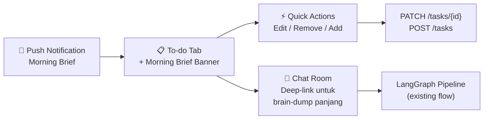
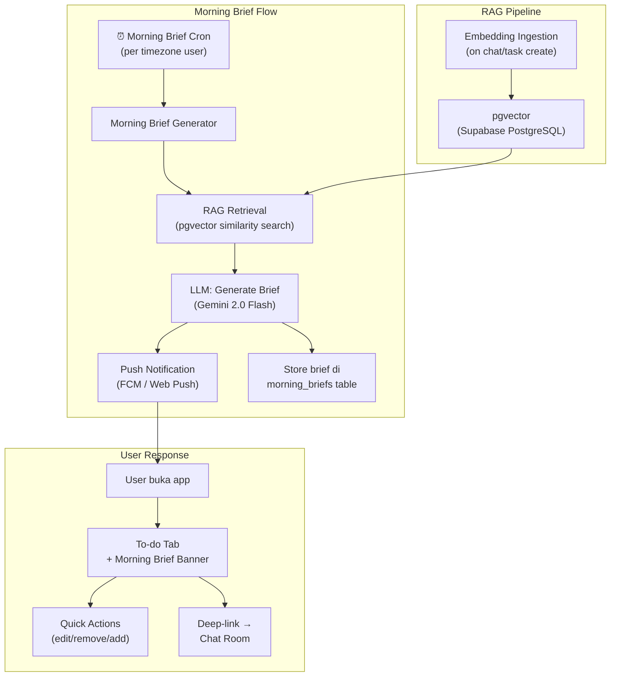

# Implementation Plan: Morning Brief & RAG Integration

> **Fitur**: Morning Brief (notifikasi to-do pagi + interaksi revisi) & RAG berbasis Vector DB  
> **Tanggal**: 2026-09-28  
> **Status**: ✅ Approved oleh User  
> **Fase Target**: Fase 3 (Otonomi Penuh)

---

## Goal Description

### Problem Statement
Saat ini ALUR belum memiliki mekanisme **proaktif** untuk mengingatkan user tentang to-do list mereka di pagi hari. User harus membuka aplikasi secara manual untuk melihat task hari ini. Selain itu, AI Companion Agent saat ini beroperasi tanpa **grounding data** yang terstruktur — hanya mengandalkan 20 pesan terakhir dan 7 hari conversation history sebagai konteks, yang rentan terhadap **halusinasi** ketika konteks lebih lama dibutuhkan.

### What This Plan Accomplishes
1. **Morning Brief**: Sistem notifikasi pagi yang mengirim ringkasan to-do list + insight AI ke user, dengan kemampuan user merespons langsung untuk merevisi/menambah task.
2. **RAG Pipeline**: Retrieval-Augmented Generation berbasis vector database untuk memastikan setiap output AI (termasuk morning brief) di-ground-kan pada data historis user yang relevan.

---

## User Review Required

> [!IMPORTANT]
> **Keputusan UX Kritis**: Bagaimana user merespons Morning Brief notification? Lihat Section "UX Brainstorm" di bawah untuk 3 opsi yang di-evaluasi. **Rekomendasi: Opsi C (Inline Quick Actions + Deep-link ke Chat Room)**.

> [!WARNING]
> **Infrastruktur Baru**: RAG memerlukan vector database. Plan ini mengusulkan **pgvector** (ekstensi PostgreSQL di Supabase) agar tidak menambah layanan eksternal. Namun ini memerlukan aktivasi ekstensi di Supabase dashboard.

> [!CAUTION]
> **Biaya Embedding**: Setiap pesan chat dan task yang disimpan akan di-embed. Estimasi: ~0.5-1 USD/1M tokens dengan model `text-embedding-004` (Gemini). Untuk MVP (<100 user), biaya ini negligible.

---

## Resolved Decisions

1. ✅ **Jam notifikasi**: Gunakan `preferences.notifications.reminder_hour` yang sudah ada (default: 8). Tidak perlu field baru.
2. ✅ **Scope Morning Brief**: **Dinamis** — konten brief disesuaikan konteks user hari itu:
   - Task hari ini → **selalu tampil**
   - Task MISSED kemarin → **tampil jika ada** yang `missed_follow_up = PENDING`
   - AI insight terbaru → **tampil jika ada** yang `surfaced = TRUE` dan belum dibaca
   - Estimasi kapasitas → **selalu tampil** (dihitung dari `daily_capacity_hours` − total `estimated_minutes`)
   - Jika hari kosong (0 task) → brief tetap muncul dengan pesan positif + saran dari RAG
3. ✅ **Embedding model**: `text-embedding-004` (Gemini) — **free tier** (1500 req/menit, cukup untuk MVP). Migrasi ke model lain jika kuota terlampaui.
4. ✅ **UX Respons**: **Opsi C — Inline Quick Actions + Deep-link ke Chat Room** (Morning Brief Banner di To-do tab).

---

## UX Brainstorm: Respons Notifikasi Morning Brief

### Konteks
User menerima push notification pagi berisi ringkasan to-do. User ingin merespons (revisi task, tambah task baru, konfirmasi). Evaluasi 3 pendekatan:

### Opsi A: Brain Dump (Full Chat Room)
```
[Notifikasi] → Tap → Buka Chat Room Tab → User ketik bebas → AI parse
```

| Aspek | Evaluasi |
|:---|:---|
| **Pro** | Sudah ada infrastruktur (Chat Room + Extractor pipeline). Fleksibel untuk input panjang. |
| **Kontra** | Terlalu berat untuk konteks pagi (user baru bangun, butuh quick action). Membuka full Chat Room untuk sekadar konfirmasi/edit 1 task = over-engineered. Context switch dari notifikasi ke tab lain. |
| **Verdict** | ❌ Tidak ideal sebagai respons utama notifikasi pagi. |

### Opsi B: Chat Modal (Overlay)
```
[Notifikasi] → Tap → Modal overlay muncul di atas layar → Mini chat → AI parse
```

| Aspek | Evaluasi |
|:---|:---|
| **Pro** | Lebih ringan dari full Chat Room. Tidak perlu navigasi tab. Focused context. |
| **Kontra** | Duplikasi UI: perlu build modal chat terpisah dari Chat Room. Maintenance burden. Input masih text-based (lambat untuk quick action pagi). Melanggar prinsip ALUR "1 ruang chat" (PRD §3.3). |
| **Verdict** | ⚠️ Feasible tapi menambah kompleksitas UI tanpa gain signifikan. |

### Opsi C: Inline Quick Actions + Deep-link ke Chat Room ⭐ (REKOMENDASI)
```
[Notifikasi] → Tap → Buka To-do Tab (Daily Focus) dengan Morning Brief Banner
┌─────────────────────────────────────────────┐
│ 🌅 Selamat pagi! 3 task hari ini:           │
│                                             │
│ ☐ Beli susu                    [Edit] [❌]  │
│ ☐ Review laporan (est. 2 jam)  [Edit] [❌]  │
│ ☐ Meeting tim (14:00)          [Edit] [❌]  │
│                                             │
│ ⚡ Kapasitas tersisa: ~4 jam                 │
│                                             │
│ [+ Tambah task]  [💬 Cerita ke AI]          │
└─────────────────────────────────────────────┘
```

| Aspek | Evaluasi |
|:---|:---|
| **Pro** | **Quick action** (edit/hapus/tambah) tanpa typing. Sesuai prinsip "frontend sesederhana kertas" (PRD §1). Deep-link ke Chat Room untuk brain-dump panjang = tidak duplikasi. Familiar UX pattern (action pada item). Morning brief = view state, bukan fitur terpisah. |
| **Kontra** | Butuh komponen Banner baru di To-do tab. |
| **Verdict** | ✅ **Paling sesuai** dengan filosofi ALUR. Cepat, minimalis, tidak duplikasi Chat Room. |

### Kesimpulan UX



**Rekomendasi final**: Gunakan **Opsi C** — Morning Brief Banner di To-do Tab dengan inline quick actions. Untuk input yang lebih kompleks, deep-link ke Chat Room yang sudah ada.

---

## Proposed Changes

### Arsitektur Overview



---

### Component 1: Database Schema Changes

#### [NEW] Migration: `012_enable_pgvector.sql`

Aktivasi ekstensi pgvector di Supabase:

```sql
-- Aktifkan ekstensi pgvector (harus dilakukan via Supabase Dashboard atau migration)
CREATE EXTENSION IF NOT EXISTS vector;
```

#### [NEW] Migration: `013_create_embeddings.sql`

Tabel untuk menyimpan embeddings dari semua konten user:

```sql
CREATE TYPE embedding_source AS ENUM ('TASK', 'CONVERSATION', 'INSIGHT');

CREATE TABLE embeddings (
    id              UUID PRIMARY KEY DEFAULT gen_random_uuid(),
    user_id         UUID NOT NULL REFERENCES users(id) ON DELETE CASCADE,
    source_type     embedding_source NOT NULL,
    source_id       UUID NOT NULL,           -- FK ke tasks.id / conversation_logs.id / ai_insights.id
    content_text    TEXT NOT NULL,            -- teks asli yang di-embed
    embedding       vector(768) NOT NULL,    -- dimensi 768 (Gemini text-embedding-004)
    metadata        JSONB DEFAULT '{}',      -- konteks tambahan (assigned_date, message_type, dll)
    created_at      TIMESTAMPTZ NOT NULL DEFAULT NOW()
);

-- Index untuk similarity search (cosine distance)
CREATE INDEX embeddings_user_vector_idx
    ON embeddings USING ivfflat (embedding vector_cosine_ops)
    WITH (lists = 100);

CREATE INDEX embeddings_user_source_idx
    ON embeddings (user_id, source_type);

-- Prevent duplicate embeddings per source
CREATE UNIQUE INDEX embeddings_source_uidx
    ON embeddings (source_type, source_id);
```

RLS:
```sql
ALTER TABLE embeddings ENABLE ROW LEVEL SECURITY;

CREATE POLICY "embeddings: read own" ON embeddings
    FOR SELECT USING (auth.uid() = user_id);
```

#### [NEW] Migration: `014_create_morning_briefs.sql`

```sql
CREATE TABLE morning_briefs (
    id              UUID PRIMARY KEY DEFAULT gen_random_uuid(),
    user_id         UUID NOT NULL REFERENCES users(id) ON DELETE CASCADE,
    brief_date      DATE NOT NULL,
    content         JSONB NOT NULL,          -- structured brief data
    -- content schema:
    -- {
    --   "greeting": "Selamat pagi!",
    --   "tasks": [{ "id": "...", "title": "...", "estimated_minutes": 30 }],
    --   "missed_tasks": [{ "id": "...", "title": "...", "follow_up": "PENDING" }],
    --   "capacity_summary": { "total_hours": 8, "scheduled_hours": 4.5, "remaining_hours": 3.5 },
    --   "ai_note": "Kemarin kamu selesaikan 4 dari 5 task. Hari ini lebih ringan."
    -- }
    notification_sent BOOLEAN NOT NULL DEFAULT FALSE,
    opened_at       TIMESTAMPTZ,             -- kapan user buka brief
    created_at      TIMESTAMPTZ NOT NULL DEFAULT NOW()
);

CREATE UNIQUE INDEX morning_briefs_user_date_uidx
    ON morning_briefs (user_id, brief_date);

CREATE INDEX morning_briefs_unsent_idx
    ON morning_briefs (notification_sent, brief_date)
    WHERE notification_sent = FALSE;
```

RLS:
```sql
ALTER TABLE morning_briefs ENABLE ROW LEVEL SECURITY;

CREATE POLICY "morning_briefs: read own" ON morning_briefs
    FOR SELECT USING (auth.uid() = user_id);
```

#### [MODIFY] `users.preferences` JSONB schema

Tambah field notifikasi morning brief:

```jsonc
{
  // ... existing fields ...
  "notifications": {
    "enabled": true,
    "reminder_hour": 8,
    "morning_brief_enabled": true    // NEW: default true
  }
}
```

---

### Component 2: RAG Pipeline (Backend)

#### [NEW] `backend/app/services/embedding_service.py`

Service untuk mengelola embeddings:

```python
"""Embedding service: generate & store vector embeddings for RAG."""
import hashlib
from uuid import UUID
from typing import Literal

import google.generativeai as genai
from supabase import AsyncClient

EmbeddingSource = Literal["TASK", "CONVERSATION", "INSIGHT"]

EMBEDDING_MODEL = "models/text-embedding-004"
EMBEDDING_DIMENSION = 768


class EmbeddingService:
    def __init__(self, supabase: AsyncClient):
        self.db = supabase

    async def embed_text(self, text: str) -> list[float]:
        """Generate embedding vector from text using Gemini."""
        result = genai.embed_content(
            model=EMBEDDING_MODEL,
            content=text,
            task_type="retrieval_document",
        )
        return result["embedding"]

    async def upsert_embedding(
        self,
        user_id: UUID,
        source_type: EmbeddingSource,
        source_id: UUID,
        content_text: str,
        metadata: dict | None = None,
    ) -> None:
        """Generate and store embedding for a piece of content."""
        vector = await self.embed_text(content_text)
        await self.db.table("embeddings").upsert(
            {
                "user_id": str(user_id),
                "source_type": source_type,
                "source_id": str(source_id),
                "content_text": content_text,
                "embedding": vector,
                "metadata": metadata or {},
            },
            on_conflict="source_type,source_id",
        ).execute()

    async def similarity_search(
        self,
        user_id: UUID,
        query: str,
        top_k: int = 10,
        source_filter: EmbeddingSource | None = None,
    ) -> list[dict]:
        """Find most similar content to query using cosine similarity."""
        query_vector = await self.embed_text(query)

        # Use Supabase RPC for pgvector similarity search
        params = {
            "query_embedding": query_vector,
            "match_user_id": str(user_id),
            "match_count": top_k,
        }
        if source_filter:
            params["filter_source"] = source_filter

        result = await self.db.rpc(
            "match_embeddings", params
        ).execute()
        return result.data
```

#### [NEW] `backend/app/services/rag_service.py`

RAG orchestration layer:

```python
"""RAG service: retrieval-augmented generation for grounded AI responses."""
from uuid import UUID

from app.services.embedding_service import EmbeddingService


class RAGService:
    def __init__(self, embedding_service: EmbeddingService):
        self.embeddings = embedding_service

    async def retrieve_context(
        self,
        user_id: UUID,
        query: str,
        top_k: int = 10,
    ) -> str:
        """Retrieve relevant context for AI generation."""
        results = await self.embeddings.similarity_search(
            user_id=user_id,
            query=query,
            top_k=top_k,
        )

        if not results:
            return "Tidak ada konteks historis yang relevan ditemukan."

        context_parts = []
        for r in results:
            source = r["source_type"]
            text = r["content_text"]
            meta = r.get("metadata", {})
            date = meta.get("date", "unknown")
            context_parts.append(
                f"[{source} | {date}] {text}"
            )

        return "\n---\n".join(context_parts)

    async def generate_grounded_prompt(
        self,
        user_id: UUID,
        user_query: str,
        system_context: str = "",
    ) -> str:
        """Build a RAG-augmented prompt with retrieved context."""
        retrieved = await self.retrieve_context(user_id, user_query)

        return f"""## Konteks Historis User (dari database, FAKTA — jangan hallucinate di luar ini):
{retrieved}

## Instruksi Sistem:
{system_context}

## Pesan User:
{user_query}

## ATURAN KETAT:
- HANYA gunakan informasi dari Konteks Historis di atas.
- Jika informasi tidak ada di konteks, katakan "Saya tidak punya data tentang itu" — JANGAN mengarang.
- Sebutkan sumber data jika memungkinkan (misal: "Berdasarkan task kamu tanggal X...").
"""
```

#### [NEW] SQL Function: `match_embeddings`

```sql
-- Supabase RPC function for vector similarity search
CREATE OR REPLACE FUNCTION match_embeddings(
    query_embedding vector(768),
    match_user_id UUID,
    match_count INT DEFAULT 10,
    filter_source embedding_source DEFAULT NULL
)
RETURNS TABLE (
    id UUID,
    source_type embedding_source,
    source_id UUID,
    content_text TEXT,
    metadata JSONB,
    similarity FLOAT
)
LANGUAGE plpgsql
AS $$
BEGIN
    RETURN QUERY
    SELECT
        e.id,
        e.source_type,
        e.source_id,
        e.content_text,
        e.metadata,
        1 - (e.embedding <=> query_embedding) AS similarity
    FROM embeddings e
    WHERE e.user_id = match_user_id
      AND (filter_source IS NULL OR e.source_type = filter_source)
    ORDER BY e.embedding <=> query_embedding
    LIMIT match_count;
END;
$$;
```

---

### Component 3: Embedding Ingestion Hooks

#### [MODIFY] `backend/app/api/chat.py`

Setelah menyimpan pesan ke `conversation_logs`, trigger embedding:

```python
# Setelah INSERT ke conversation_logs berhasil:
await embedding_service.upsert_embedding(
    user_id=user_id,
    source_type="CONVERSATION",
    source_id=log_id,
    content_text=message_content,
    metadata={
        "date": str(session_date),
        "role": role,
        "message_type": message_type,
    },
)
```

#### [MODIFY] `backend/app/api/tasks.py`

Setelah task dibuat/diupdate, embed kontennya:

```python
# Setelah INSERT/UPDATE task berhasil:
await embedding_service.upsert_embedding(
    user_id=user_id,
    source_type="TASK",
    source_id=task_id,
    content_text=f"{task_title} (assigned: {assigned_date}, status: {status})",
    metadata={
        "date": str(assigned_date),
        "status": status,
        "source": task_source,
        "goal_id": str(goal_id) if goal_id else None,
    },
)
```

---

### Component 4: Morning Brief Generator

#### [NEW] `backend/app/services/morning_brief_service.py`

```python
"""Morning Brief: generate and send daily task summaries."""
from datetime import date, timedelta
from uuid import UUID

from app.services.rag_service import RAGService
from supabase import AsyncClient


class MorningBriefService:
    def __init__(self, db: AsyncClient, rag: RAGService):
        self.db = db
        self.rag = rag

    async def generate_brief(self, user_id: UUID, brief_date: date) -> dict:
        """Generate morning brief for a user."""

        # 1. Ambil task hari ini
        tasks_today = await self.db.table("tasks").select("*").eq(
            "user_id", str(user_id)
        ).eq("assigned_date", str(brief_date)).execute()

        # 2. Ambil task MISSED kemarin yang follow_up = PENDING
        yesterday = brief_date - timedelta(days=1)
        missed_tasks = await self.db.table("tasks").select("*").eq(
            "user_id", str(user_id)
        ).eq("status", "MISSED").eq(
            "missed_follow_up", "PENDING"
        ).gte("assigned_date", str(yesterday)).execute()

        # 3. Hitung kapasitas
        user = await self.db.table("users").select(
            "daily_capacity_hours, preferences"
        ).eq("id", str(user_id)).single().execute()

        capacity_hours = float(user.data["daily_capacity_hours"])
        scheduled_minutes = sum(
            t.get("estimated_minutes", 0) or 0
            for t in tasks_today.data
        )
        scheduled_hours = scheduled_minutes / 60
        remaining_hours = max(0, capacity_hours - scheduled_hours)

        # 4. RAG: ambil konteks relevan untuk AI note
        rag_context = await self.rag.retrieve_context(
            user_id=user_id,
            query=f"ringkasan aktivitas dan pola untuk tanggal {brief_date}",
            top_k=5,
        )

        # 5. Generate AI note via LLM (dengan grounding)
        ai_note = await self._generate_ai_note(
            tasks_today=tasks_today.data,
            missed_tasks=missed_tasks.data,
            capacity_remaining=remaining_hours,
            rag_context=rag_context,
        )

        brief_content = {
            "greeting": self._get_greeting(brief_date),
            "tasks": [
                {
                    "id": t["id"],
                    "title": t["title"],
                    "estimated_minutes": t.get("estimated_minutes"),
                }
                for t in tasks_today.data
                if t["status"] == "PENDING"
            ],
            "missed_tasks": [
                {
                    "id": t["id"],
                    "title": t["title"],
                    "follow_up": t["missed_follow_up"],
                }
                for t in missed_tasks.data
            ],
            "capacity_summary": {
                "total_hours": capacity_hours,
                "scheduled_hours": round(scheduled_hours, 1),
                "remaining_hours": round(remaining_hours, 1),
            },
            "ai_note": ai_note,
        }

        # 6. Simpan brief
        await self.db.table("morning_briefs").upsert(
            {
                "user_id": str(user_id),
                "brief_date": str(brief_date),
                "content": brief_content,
            },
            on_conflict="user_id,brief_date",
        ).execute()

        return brief_content

    async def _generate_ai_note(self, **kwargs) -> str:
        """Generate grounded AI note using RAG context."""
        # LLM call with strict grounding instructions
        # ... (implementation detail)
        pass

    def _get_greeting(self, d: date) -> str:
        weekday_names = ["Senin", "Selasa", "Rabu", "Kamis", "Jumat", "Sabtu", "Minggu"]
        return f"Selamat pagi! Hari {weekday_names[d.weekday()]}, {d.strftime('%d %B %Y')}."
```

#### [NEW] API Endpoint: `GET /morning-brief`

```python
@router.get("/morning-brief")
async def get_morning_brief(
    date: date = Query(default=None),  # default: hari ini
    user_id: UUID = Depends(get_current_user),
    db: AsyncClient = Depends(get_db),
):
    """Get morning brief for a specific date."""
    brief_date = date or datetime.now().date()

    result = await db.table("morning_briefs").select("*").eq(
        "user_id", str(user_id)
    ).eq("brief_date", str(brief_date)).single().execute()

    if not result.data:
        # Generate on-demand if cron hasn't run yet
        service = MorningBriefService(db, rag_service)
        brief = await service.generate_brief(user_id, brief_date)
        return {"data": brief, "generated": True}

    # Mark as opened
    await db.table("morning_briefs").update(
        {"opened_at": "now()"}
    ).eq("id", result.data["id"]).execute()

    return {"data": result.data["content"], "generated": False}
```

---

### Component 5: Cron Job — Morning Brief Generator

#### [NEW] pg_cron schedule

```sql
-- Morning Brief Generator (setiap jam, timezone-aware)
SELECT cron.schedule(
    'morning-brief-generator',
    '0 * * * *',  -- setiap jam (cek timezone user)
    $$
        SELECT net.http_post(
            url := current_setting('app.backend_url') || '/internal/cron/morning-brief',
            headers := jsonb_build_object(
                'Authorization', 'Bearer ' || current_setting('app.cron_secret')
            )
        );
    $$
);
```

#### [NEW] `POST /internal/cron/morning-brief`

```python
@router.post("/internal/cron/morning-brief")
async def cron_morning_brief(
    request: Request,
    db: AsyncClient = Depends(get_db),
):
    """Generate morning briefs for users whose reminder_hour matches current UTC hour."""
    verify_cron_secret(request)

    # Cari user yang reminder_hour-nya cocok dengan jam sekarang (timezone-aware)
    current_utc = datetime.utcnow()

    users = await db.rpc("users_due_morning_brief", {
        "current_utc_hour": current_utc.hour,
    }).execute()

    for user in users.data:
        service = MorningBriefService(db, rag_service)
        brief = await service.generate_brief(
            UUID(user["id"]),
            date.today(),  # adjusted per user timezone in service
        )
        # Send push notification
        await push_service.send_morning_brief(
            user_id=UUID(user["id"]),
            brief=brief,
        )

    return {"processed": len(users.data)}
```

---

### Component 6: Frontend — Morning Brief Banner (Mobile)

#### [NEW] `mobile/lib/widgets/morning_brief_banner.dart`

Banner widget yang ditampilkan di atas To-do Daily Focus view:

```
┌─────────────────────────────────────────────┐
│ 🌅 Selamat pagi! Rabu, 28 September 2026   │
│                                             │
│ ☐ Beli susu                    [Edit] [❌]  │
│ ☐ Review laporan (2 jam)       [Edit] [❌]  │
│ ☐ Meeting tim (14:00)          [Edit] [❌]  │
│                                             │
│ ⚠️ 1 task kemarin belum selesai:            │
│   → "Kirim email client" [Udah] [Skip] [➡] │
│                                             │
│ ⚡ Kapasitas tersisa: ~4 jam                 │
│ 💬 "Kemarin kamu selesaikan 4/5 task. Hari  │
│     ini lebih ringan — good pace!"          │
│                                             │
│ [+ Tambah task]  [💬 Cerita ke AI]          │
└─────────────────────────────────────────────┘
```

**Behavior:**
- Muncul otomatis saat user pertama kali buka app di hari itu (sebelum jam 12:00)
- Dismissable (swipe up atau tap ×)
- Quick actions: Edit task → inline edit, ❌ → remove task, + → add task
- "Cerita ke AI" → deep-link ke Chat Room tab
- Follow-up missed tasks: [Udah] → FORGOT, [Skip] → SKIPPED, [➡] → RESCHEDULED

**Design tokens** (sesuai DESIGN.md):
- Background: `#F0EFED` (Paper Gray)
- Text: `#111111` (Ink Black)
- Accent: `#FF5420` (Vermilion Orange) untuk completed items
- Border: `#DEDBD6`
- Font: Inter

---

### Component 7: Hierarchical Memory & Dynamic Persona (Hermes-Style)

#### [NEW] Migration: `016_add_ai_profile_summary.sql`
Menambahkan kolom untuk Core Profile (JSON padat yang diperbarui secara background).

```sql
ALTER TABLE users ADD COLUMN ai_profile_summary JSONB DEFAULT '{}';
-- Contoh isi: {"work_style": "...", "current_stress": "high", "preferred_tone": "..."}
```

#### [MODIFY] `backend/app/agents/companion.py`

Update Companion Agent untuk menggunakan 3-Layer Memory dan Dynamic Persona Routing:

```python
# 1. Tentukan Active Persona (Dynamic Prompt Modulation)
active_persona_prompt = select_active_persona(
    recent_tasks=tasks_today, 
    burnout_signals=user_signals
) 
# Return 1 dari 4 modul prompt: Honest, Gentle, Strategist, atau Minimalist

# 2. Ambil 3-Layer Memory
core_profile = await get_user_profile_summary(user_id) # Level 1 (Selalu dimuat, ~50 token)
recent_messages = await get_recent_conversations(user_id, limit=5) # Level 2 (3-5 pesan)
rag_context = await rag_service.retrieve_context(user_id, query=user_message) # Level 3 (Archival)

# 3. Gabungkan sebagai prompt hemat token
grounded_prompt = f"""
## Active Persona:
{active_persona_prompt}

## User Core Profile:
{json.dumps(core_profile)}

## Short-term Memory (Working Context):
{format_messages(recent_messages)}

## Archival Memory (RAG — relevan jika ditanyakan):
{rag_context}
"""
```

#### [NEW] Cron: `background_memory_condenser`
Cron harian yang merangkum chat hari itu menjadi update di `users.ai_profile_summary` untuk menjaga prompt Companion Agent tetap ringkas tanpa melupakan profil user.

---

## Verification Plan

### Automated Tests

```bash
# Backend unit tests
cd backend
pytest tests/test_embedding_service.py -v
pytest tests/test_rag_service.py -v
pytest tests/test_morning_brief_service.py -v

# Integration test: full RAG pipeline
pytest tests/integration/test_rag_pipeline.py -v

# Database migration test
supabase db reset --local
supabase db push
```

**Test cases yang harus ada:**
1. `test_embed_and_retrieve` — embed 10 task, query "beli susu", pastikan task relevan di top-3
2. `test_no_cross_user_leakage` — user A tidak bisa retrieve embedding user B
3. `test_morning_brief_content_structure` — validasi schema JSON brief
4. `test_morning_brief_capacity_calculation` — 8 jam capacity, 3 task × 2 jam = 2 jam remaining
5. `test_companion_rag_grounding` — companion TIDAK hallucinate task yang tidak ada di embedding
6. `test_duplicate_embedding_upsert` — update task title → embedding di-update, bukan ditambah

### Manual Verification

1. **Morning Brief Banner**: Buka app mobile di pagi hari → lihat banner muncul → tap quick actions → verifikasi task berubah di DB
2. **RAG Accuracy**: Di Chat Room, tanya "apa yang aku kerjakan minggu lalu?" → jawaban harus match dengan task history yang sebenarnya
3. **Push Notification**: Verifikasi notifikasi diterima di waktu yang sesuai preference user
4. **Edge case**: User tanpa task hari ini → brief tetap muncul dengan pesan "Hari ini kosong"

---

## Ringkasan Perubahan File

| Action | File/Path | Deskripsi |
|:---|:---|:---|
| [NEW] | `backend/app/services/embedding_service.py` | Service untuk generate & store embeddings |
| [NEW] | `backend/app/services/rag_service.py` | RAG orchestration layer |
| [NEW] | `backend/app/services/morning_brief_service.py` | Morning brief generation logic |
| [NEW] | `backend/app/api/morning_brief.py` | API endpoint `GET /morning-brief` |
| [MODIFY] | `backend/app/api/chat.py` | Hook embedding setelah simpan pesan |
| [MODIFY] | `backend/app/api/tasks.py` | Hook embedding setelah create/update task |
| [MODIFY] | `backend/app/agents/companion.py` | Integrasi RAG context (long-term memory) |
| [NEW] | `supabase/migrations/012_enable_pgvector.sql` | Aktifkan ekstensi pgvector |
| [NEW] | `supabase/migrations/013_create_embeddings.sql` | Tabel embeddings + index + RLS |
| [NEW] | `supabase/migrations/014_create_morning_briefs.sql` | Tabel morning_briefs + RLS |
| [NEW] | `supabase/migrations/015_match_embeddings_rpc.sql` | SQL function untuk vector search |
| [MODIFY] | `supabase/migrations/011_setup_pg_cron.sql` | Tambah cron `morning-brief-generator` |
| [NEW] | `mobile/lib/widgets/morning_brief_banner.dart` | Morning Brief Banner widget |
| [MODIFY] | `mobile/lib/screens/todo/todo_screen.dart` | Tampilkan banner di atas Daily Focus |
| [MODIFY] | `.agents/skills/read-docs/docs/DATABASE.md` | Dokumentasi tabel baru |
| [MODIFY] | `.agents/skills/read-docs/docs/technical.md` | Update arsitektur dengan RAG & Morning Brief |
| [MODIFY] | `.agents/skills/read-docs/docs/PRD.md` | Tambah spec Morning Brief di §3.2 dan §6 |

---

## Dependensi & Risiko

| Risiko | Mitigasi |
|:---|:---|
| pgvector belum diaktifkan di Supabase project | Aktivasi via Supabase Dashboard → Extensions → pgvector |
| Embedding cost meningkat seiring user growth | Batch embedding, cache embeddings yang belum berubah |
| Vercel 10s timeout untuk morning brief generation | Gunakan batching (sama seperti weekly-reflection) |
| Push notification infrastructure belum ada | Perlu setup FCM (Firebase Cloud Messaging) untuk mobile, Web Push API untuk web |

---

# Changelog

| Tanggal | Versi | Perubahan |
|:---|:---|:---|
| 2026-09-28 | v1.0 | Initial plan: Morning Brief + RAG + UX Brainstorm |
| 2026-09-28 | v1.1 | ✅ Approved: UX=Opsi C, jam=reminder_hour existing, scope=dinamis, embedding=Gemini free-tier |
