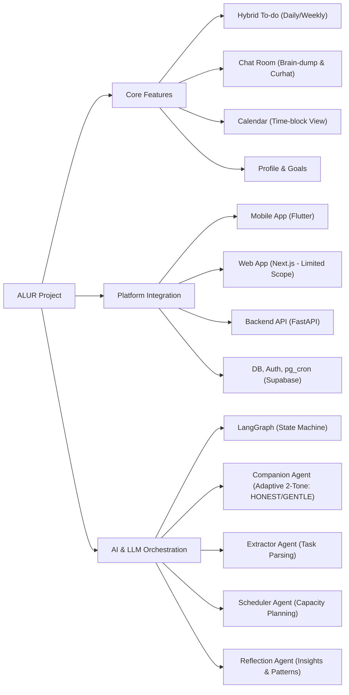
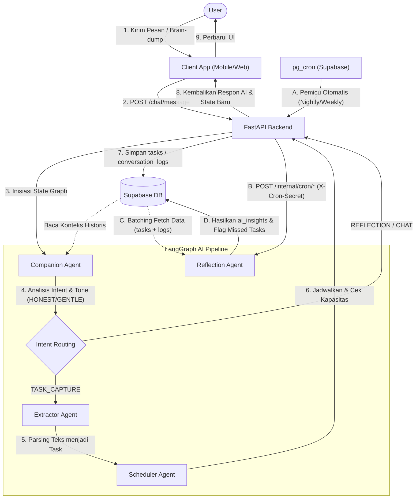
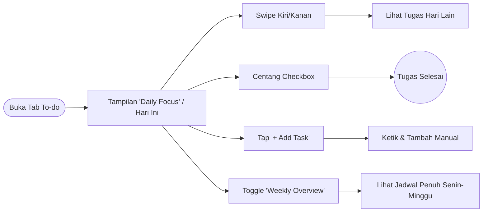
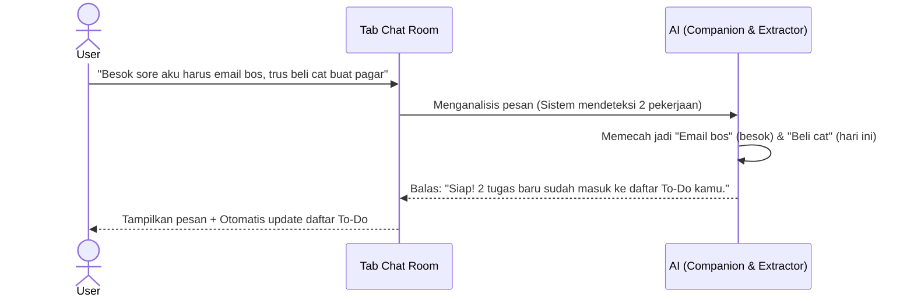
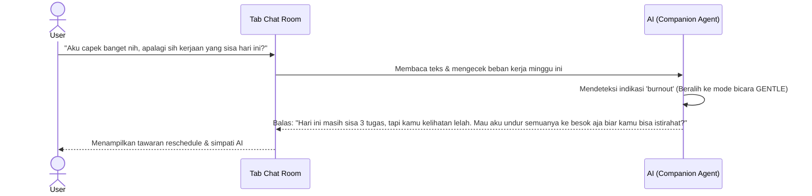
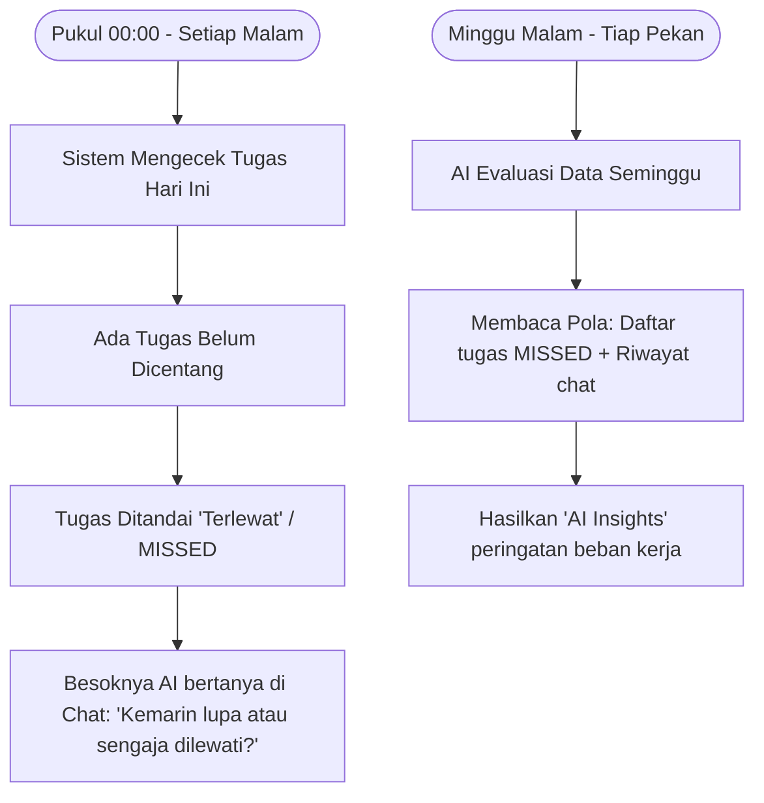

# Peta Konsep dan Alur Sistem ALUR

Dokumen ini memuat rangkuman visual dari struktur proyek ALUR, yang meliputi struktur fitur utama, integrasi platform, serta orkestrasi LLM (LangGraph), dan alur pipeline data.

## 1. Mindmap: Struktur Fitur, Integrasi, dan LLM

Diagram berikut memetakan komponen utama dalam ekosistem ALUR:

## 2. Flowchart: Pipeline Data dan Proses Sistem Utama

Diagram alir berikut menunjukkan bagaimana data bergerak dari interaksi pengguna (di Mobile/Web) masuk ke backend FastAPI, diproses oleh agen AI dalam LangGraph, serta bagaimana cron job di latar belakang menyatukan data untuk analisis refleksi.

## 3. Alur Penggunaan Fitur (User Journey)

Bagian ini menjabarkan bagaimana setiap fitur inti digunakan dari sudut pandang pengguna sehari-hari dengan bahasa yang mudah dipahami.

### A. Fitur To-Do (Eksekusi Harian & Mingguan)
Fokus utama pengguna untuk mengeksekusi tugas tanpa disibukkan dengan terlalu banyak informasi visual.

### B. Fitur Brain-dump (Ekstraksi Tugas Otomatis)
Mengubah pikiran acak dan tumpukan ide mentah langsung menjadi daftar tugas terstruktur melalui percakapan biasa.

### C. Fitur Curhat & Cek Kapasitas Beban Kerja
Saat pengguna merasa kewalahan, Chat Room berubah menjadi asisten empati yang secara aktif mengecek sisa energi pengguna.

### D. Fitur Evaluasi Otomatis (Review Malam & Mingguan)
Sistem merapikan tugas-tugas secara diam-diam di latar belakang agar pengguna selalu mendapat rekomendasi yang jujur dan realistis.

---
**Catatan Penting:** 
Dokumentasi ini merangkum spesifikasi ALUR agar mudah dipahami secara visual, dengan berpegang teguh pada pendekatan arsitektur "Backend-Heavy & Simple Frontend", di mana orkestrasi *state* dan kecerdasan sepenuhnya terpusat pada multi-agent LangGraph.
